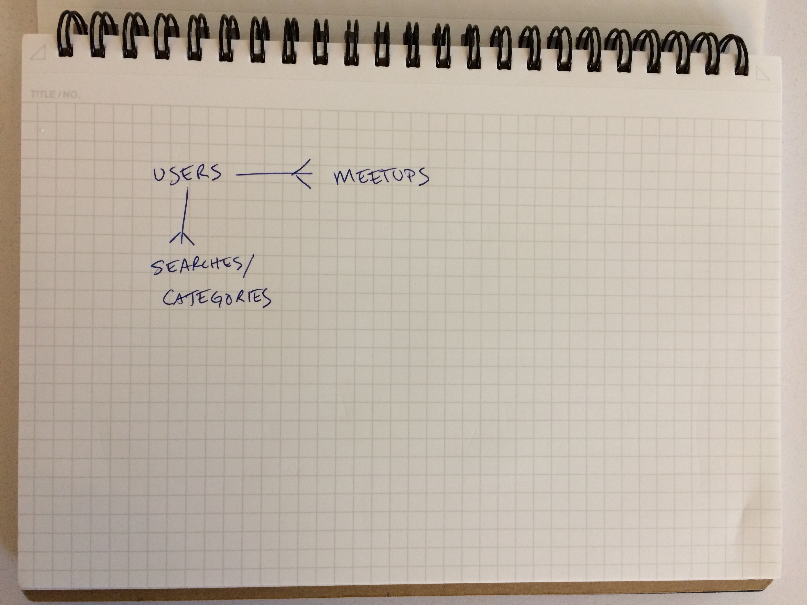

# Meetup Server

This is the server/API for the Meetup app.

## Links

-  FRONT END REPO   https://github.com/prankmode/meetup-client
-  BACK END REPO    https://github.com/prankmode/meetup-server
-  FRONT END DEPLOYED    https://prankmode.github.io/meetup-client/
-  BACK END DEPLOYED    https://sleepy-bayou-40417.herokuapp.com/


## Dependencies

This is a Rails server.  It calls the Meetup.com API. It uses a Ruby Gem to
interface to the Meetup API.

The API handles a search request and returns a list of meetups (max 50) that
will be happening in the near future.  From that list, the user can save ones that they are interested in.  The server will save these meetups.

The server also implement an email that can be sent out with the list of
the user's saved meetups.


## API

### Meetup


| Verb   | URI Pattern            | Controller#Action         |
|--------|------------------------|---------------------------|
| GET    | `/meetups`             | `meetups#index`           |
| GET    | `/search`              | `meetups#search`          |
| GET    | `/remind`              | `meetups#reminder_email`  |
| DELETE | `/meetups/:id`         | `meetups#destroy`         |
| POST   | `/meetups/:id`         | `meetups#create_id`       |


### Authentication

| Verb   | URI Pattern            | Controller#Action |
|--------|------------------------|-------------------|
| POST   | `/sign-up`             | `users#signup`    |
| POST   | `/sign-in`             | `users#signin`    |
| PATCH  | `/change-password/:id` | `users#changepw`  |
| DELETE | `/sign-out/:id`        | `users#signout`   |

#### POST /sign-up

Request:

```sh
curl http://localhost:4741/sign-up \
  --include \
  --request POST \
  --header "Content-Type: application/json" \
  --data '{
    "credentials": {
      "email": "'"${EMAIL}"'",
      "password": "'"${PASSWORD}"'",
      "password_confirmation": "'"${PASSWORD}"'"
    }
  }'
```

```sh
EMAIL=ava@bob.com PASSWORD=hannah scripts/sign-up.sh
```

Response:

```md
HTTP/1.1 201 Created
Content-Type: application/json; charset=utf-8

{
  "user": {
    "id": 1,
    "email": "ava@bob.com"
  }
}
```

#### POST /sign-in

Request:

```sh
curl http://localhost:4741/sign-in \
  --include \
  --request POST \
  --header "Content-Type: application/json" \
  --data '{
    "credentials": {
      "email": "'"${EMAIL}"'",
      "password": "'"${PASSWORD}"'"
    }
  }'
```

```sh
EMAIL=ava@bob.com PASSWORD=hannah scripts/sign-in.sh
```

Response:

```md
HTTP/1.1 200 OK
Content-Type: application/json; charset=utf-8

{
  "user": {
    "id": 1,
    "email": "ava@bob.com",
    "token": "BAhJIiVlZDIwZTMzMzQzODg5NTBmYjZlNjRlZDZlNzYxYzU2ZAY6BkVG--7e7f77f974edcf5e4887b56918f34cd9fe293b9f"
  }
}
```

#### PATCH /change-password/:id

Request:

```sh
curl --include --request PATCH "http://localhost:4741/change-password/$ID" \
  --header "Authorization: Token token=$TOKEN" \
  --header "Content-Type: application/json" \
  --data '{
    "passwords": {
      "old": "'"${OLDPW}"'",
      "new": "'"${NEWPW}"'"
    }
  }'
```

```sh
ID=1 OLDPW=hannah NEWPW=elle TOKEN=BAhJIiVlZDIwZTMzMzQzODg5NTBmYjZlNjRlZDZlNzYxYzU2ZAY6BkVG--7e7f77f974edcf5e4887b56918f34cd9fe293b9f scripts/change-password.sh
```

Response:

```md
HTTP/1.1 204 No Content
```

#### DELETE /sign-out/:id

Request:

```sh
curl http://localhost:4741/sign-out/$ID \
  --include \
  --request DELETE \
  --header "Authorization: Token token=$TOKEN"
```

```sh
ID=1 TOKEN=BAhJIiVlZDIwZTMzMzQzODg5NTBmYjZlNjRlZDZlNzYxYzU2ZAY6BkVG--7e7f77f974edcf5e4887b56918f34cd9fe293b9f scripts/sign-out.sh
```

Response:

```md
HTTP/1.1 204 No Content
```

### Users

| Verb | URI Pattern | Controller#Action |
|------|-------------|-------------------|
| GET  | `/users`    | `users#index`     |
| GET  | `/users/1`  | `users#show`      |

#### GET /users

Request:

```sh
curl http://localhost:4741/users \
  --include \
  --request GET \
  --header "Authorization: Token token=$TOKEN"
```

```sh
TOKEN=BAhJIiVlZDIwZTMzMzQzODg5NTBmYjZlNjRlZDZlNzYxYzU2ZAY6BkVG--7e7f77f974edcf5e4887b56918f34cd9fe293b9f scripts/users.sh
```

Response:

```md
HTTP/1.1 200 OK
Content-Type: application/json; charset=utf-8

{
  "users": [
    {
      "id": 2,
      "email": "bob@ava.com"
    },
    {
      "id": 1,
      "email": "ava@bob.com"
    }
  ]
}
```

#### GET /users/:id

Request:

```sh
curl --include --request GET http://localhost:4741/users/$ID \
  --header "Authorization: Token token=$TOKEN"
```

```sh
ID=2 TOKEN=BAhJIiVlZDIwZTMzMzQzODg5NTBmYjZlNjRlZDZlNzYxYzU2ZAY6BkVG--7e7f77f974edcf5e4887b56918f34cd9fe293b9f scripts/user.sh
```

Response:

```md
HTTP/1.1 200 OK
Content-Type: application/json; charset=utf-8

{
  "user": {
    "id": 2,
    "email": "bob@ava.com"
  }
}
```


## ERD



## [License](LICENSE)
